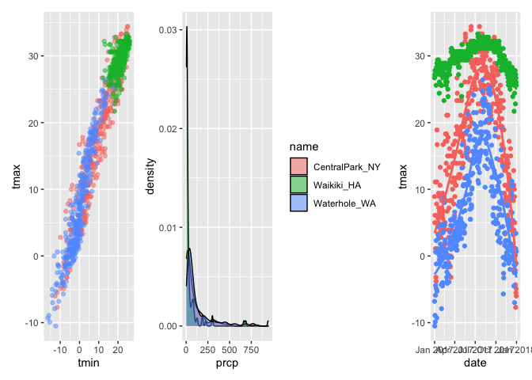
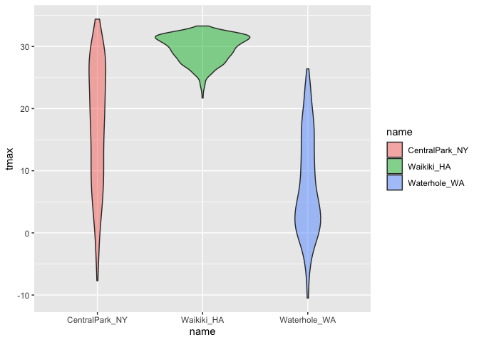

Vizualization II
================

``` r
library(tidyverse)
```

    ## ── Attaching packages ─────────────────────────────────────── tidyverse 1.3.2 ──
    ## ✔ ggplot2 3.3.6      ✔ purrr   0.3.4 
    ## ✔ tibble  3.1.8      ✔ dplyr   1.0.10
    ## ✔ tidyr   1.2.1      ✔ stringr 1.4.1 
    ## ✔ readr   2.1.2      ✔ forcats 0.5.2 
    ## ── Conflicts ────────────────────────────────────────── tidyverse_conflicts() ──
    ## ✖ dplyr::filter() masks stats::filter()
    ## ✖ dplyr::lag()    masks stats::lag()

``` r
library(patchwork)
```

1.  rnoaa = allows you to access public data
2.  lines 15 - 19 –\> bring data

``` r
weather_df = 
  rnoaa::meteo_pull_monitors(
    c("USW00094728", "USC00519397", "USS0023B17S"),
    var = c("PRCP", "TMIN", "TMAX"), 
    date_min = "2017-01-01",
    date_max = "2017-12-31") %>%
  mutate(
    name = recode(
      id, 
      USW00094728 = "CentralPark_NY", 
      USC00519397 = "Waikiki_HA",
      USS0023B17S = "Waterhole_WA"),
    tmin = tmin / 10,
    tmax = tmax / 10) %>%
  select(name, id, everything())
```

    ## Registered S3 method overwritten by 'hoardr':
    ##   method           from
    ##   print.cache_info httr

    ## using cached file: ~/Library/Caches/R/noaa_ghcnd/USW00094728.dly

    ## date created (size, mb): 2022-10-17 01:02:59 (8.411)

    ## file min/max dates: 1869-01-01 / 2022-10-31

    ## using cached file: ~/Library/Caches/R/noaa_ghcnd/USC00519397.dly

    ## date created (size, mb): 2022-10-17 01:03:09 (1.697)

    ## file min/max dates: 1965-01-01 / 2020-02-29

    ## using cached file: ~/Library/Caches/R/noaa_ghcnd/USS0023B17S.dly

    ## date created (size, mb): 2022-10-17 01:03:26 (0.952)

    ## file min/max dates: 1999-09-01 / 2022-10-31

## Remember this plot…?

``` r
weather_df %>% 
  ggplot(aes(x = tmin, y = tmax, color = name)) +
  geom_point()
```

    ## Warning: Removed 15 rows containing missing values (geom_point).

<!-- -->

## Adding Labels to Plots (USE LABS)

``` r
weather_df %>% 
  ggplot(aes(x = tmin, y = tmax, color = name)) +
  geom_point(alpha = 0.5) +
  labs(
    title = "Temperature plot",
    x = "Min daily temperature (C)",
    y = "Max daily temperature (C)",
    caption = "Data from rnoaa package; temperatures in 2017."
  )
```

    ## Warning: Removed 15 rows containing missing values (geom_point).

<!-- -->

## Scales (USE `SCALE`)

Start with the same plot

``` r
weather_df %>% 
  ggplot(aes(x = tmin, y = tmax, color = name)) +
  geom_point(alpha = 0.5) +
  labs(
    title = "Temperature plot",
    x = "Min daily temperature (C)",
    y = "Max daily temperature (C)",
    caption = "Data from rnoaa package; temperatures in 2017."
  ) +
  scale_x_continuous(
    breaks = c(-15, 0, 15),
    labels = c("-15 C", "0", "15")
  ) +
  scale_y_continuous(
    trans = "sqrt" #trans = transformation (i.e., sqrt, log)
  )
```

    ## Warning in self$trans$transform(x): NaNs produced

    ## Warning: Transformation introduced infinite values in continuous y-axis

    ## Warning: Removed 90 rows containing missing values (geom_point).

<!-- -->

## Color scales

### using scale_color_hue

``` r
weather_df %>% 
  ggplot(aes(x = tmin, y = tmax, color = name)) +
  geom_point(alpha = 0.5) +
  labs(
    title = "Temperature plot",
    x = "Min daily temperature (C)",
    y = "Max daily temperature (C)",
    caption = "Data from rnoaa package; temperatures in 2017."
  ) +
  scale_color_hue(
    name = "Location", #change index for color from "name" to "locations"
    h = c(50,300)) #color scale (h = hue of the scale)
```

    ## Warning: Removed 15 rows containing missing values (geom_point).

<!-- -->

### using VIRIDIS for color palette/options

``` r
weather_df %>% 
  ggplot(aes(x = tmin, y = tmax, color = name)) +
  geom_point(alpha = 0.5) +
  labs(
    title = "Temperature plot",
    x = "Min daily temperature (C)",
    y = "Max daily temperature (C)",
    caption = "Data from rnoaa package; temperatures in 2017."
  ) +
    viridis::scale_color_viridis(
      name = "Location",
      discrete = TRUE)
```

    ## Warning: Removed 15 rows containing missing values (geom_point).

<!-- -->

## Themes

1.  move legend location

``` r
weather_df %>% 
  ggplot(aes(x = tmin, y = tmax, color = name)) +
  geom_point(alpha = 0.5) +
  labs(
    title = "Temperature plot",
    x = "Min daily temperature (C)",
    y = "Max daily temperature (C)",
    caption = "Data from rnoaa package; temperatures in 2017."
  ) +
   viridis::scale_color_viridis(
      name = "Location",
      discrete = TRUE) +
  theme(legend.position = "bottom") #move legend from right to bottom
```

    ## Warning: Removed 15 rows containing missing values (geom_point).

<!-- -->

2.  change the overall theme

A. option 1 (theme_minimal)

``` r
weather_df %>% 
  ggplot(aes(x = tmin, y = tmax, color = name)) +
  geom_point(alpha = 0.5) +
  labs(
    title = "Temperature plot",
    x = "Min daily temperature (C)",
    y = "Max daily temperature (C)",
    caption = "Data from rnoaa package; temperatures in 2017."
  ) +
   viridis::scale_color_viridis(
      name = "Location",
      discrete = TRUE) +
  theme_minimal() #theme (minimal, bw, etc)
```

    ## Warning: Removed 15 rows containing missing values (geom_point).

<!-- -->

B. option 2 (ggthemes)

``` r
weather_df %>% 
  ggplot(aes(x = tmin, y = tmax, color = name)) +
  geom_point(alpha = 0.5) +
  labs(
    title = "Temperature plot",
    x = "Min daily temperature (C)",
    y = "Max daily temperature (C)",
    caption = "Data from rnoaa package; temperatures in 2017."
  ) +
   viridis::scale_color_viridis(
      name = "Location",
      discrete = TRUE) +
  ggthemes::theme_excel()
```

    ## Warning: Removed 15 rows containing missing values (geom_point).

<!-- -->

## Setting options

``` r
library(tidyverse)

knitr::opts_chunk$set(
  fig.width = 6,
  fig.asp = .6,
  out.width = "90%"
)

theme_set(theme_minimal() + theme(legend.position = "bottom")) #always do this everyhwere

options(
  ggplot2.continuous.color = "viridis",
  ggplot2.continuous.fill = "viridis"
)

scale_colour_discrete = scale_color_viridis_d
scale_fill_discrete = scale_fill_viridis_d
```

## Data args in `geom` = getting different behaviors

``` r
central_park =
  weather_df %>% 
  filter(name == "CentralPark_NY")

waikiki =
  weather_df %>% 
  filter(name == "Waikiki_HA")

ggplot(data = waikiki, aes(x = date, y = tmax, color = name)) +
  geom_point() +
  geom_line(data = central_park)
```

    ## Warning: Removed 3 rows containing missing values (geom_point).

<!-- -->

## `patchwork`

remember faceting?

regular vs.

``` r
weather_df %>% 
  ggplot(aes(x = tmin, fill = name)) +
  geom_density(alpha = .5)
```

    ## Warning: Removed 15 rows containing non-finite values (stat_density).

<!-- -->

facetted

``` r
weather_df %>% 
  ggplot(aes(x = tmin, fill = name)) +
  geom_density(alpha = .5) +
  facet_grid(. ~ name)
```

    ## Warning: Removed 15 rows containing non-finite values (stat_density).

<!-- -->

what happens when i want multi-panel plot (i.e., scatter & histogram)?
This is where patchwork comes in

``` r
tmax_tmin_plot =
weather_df %>% 
  ggplot(aes(x = tmin, y = tmax, color = name)) +
  geom_point(alpha = .5) +
  theme(legend.position = "none")

prcp_dens_p = 
  weather_df %>% 
  ggplot(aes(x = prcp, fill = name)) +
  geom_density(alpha = .5) # don't see much, so try

prcp_dens_p = 
  weather_df %>% 
  filter(prcp > 0) %>% 
  ggplot(aes(x = prcp, fill = name)) +
  geom_density(alpha = .5)

tmax_date_p =
  weather_df %>% 
  ggplot(aes(x = date, y = tmax, color = name)) +
  geom_point() +
  geom_smooth(se = FALSE) +
  theme(legend.position = "none")
```

Now we gonna use patchwork to put prcp_dens, tmax_date,tmax_tmin
together:

1.  putting side-by-side

``` r
tmax_tmin_plot + prcp_dens_p + tmax_date_p
```

    ## Warning: Removed 15 rows containing missing values (geom_point).

    ## `geom_smooth()` using method = 'loess' and formula 'y ~ x'

    ## Warning: Removed 3 rows containing non-finite values (stat_smooth).

    ## Warning: Removed 3 rows containing missing values (geom_point).

<!-- -->

2.  putting side by side & below ( / = below)

``` r
(tmax_tmin_plot + prcp_dens_p) / tmax_date_p
```

    ## Warning: Removed 15 rows containing missing values (geom_point).

    ## `geom_smooth()` using method = 'loess' and formula 'y ~ x'

    ## Warning: Removed 3 rows containing non-finite values (stat_smooth).

    ## Warning: Removed 3 rows containing missing values (geom_point).

<!-- -->

## Data Manipulation

``` r
weather_df %>% 
  ggplot(aes(x = name, y = tmax, fill = name)) +
  geom_violin(alpha = 0.5)
```

    ## Warning: Removed 3 rows containing non-finite values (stat_ydensity).

<!-- -->

I want to manipulate my data so the order of names is different (i.e.,
not alphabetical but low to high) CONTROL YOUR FACTORS!

``` r
weather_df %>% 
  mutate(
    name = factor(name),
    name = forcats::fct_relevel(name, c("Waikiki_HA")) ## re-arrange so Waikiki comes first
  ) %>% 
  ggplot(aes(x = name, y = tmax, fill = name)) +
  geom_violin(alpha = 0.5)
```

    ## Warning: Removed 3 rows containing non-finite values (stat_ydensity).

<!-- -->

What if I want densities for tmin & tmax simultaneously?

``` r
weather_df %>% 
  filter(name == "CentralPark_NY") %>% 
  pivot_longer(
    tmax:tmin,
    names_to = "observations",
    values_to = "temp"
  ) %>% 
  ggplot(aes(x = temp, fill = observations)) +
  geom_density(alpha = .5)
```

<!-- -->

What if I wanna do the same for all 3 names?

``` r
weather_df %>% 
  pivot_longer(
    tmax:tmin,
    names_to = "observations",
    values_to = "temp"
  ) %>% 
  ggplot(aes(x = temp, fill = observations)) +
  geom_density(alpha = .5) +
  facet_grid(. ~ name)
```

    ## Warning: Removed 18 rows containing non-finite values (stat_density).

<!-- -->
